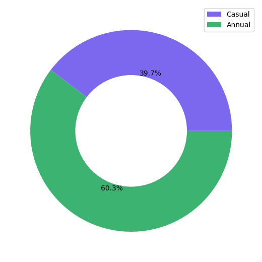
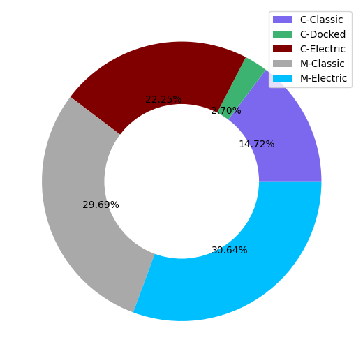
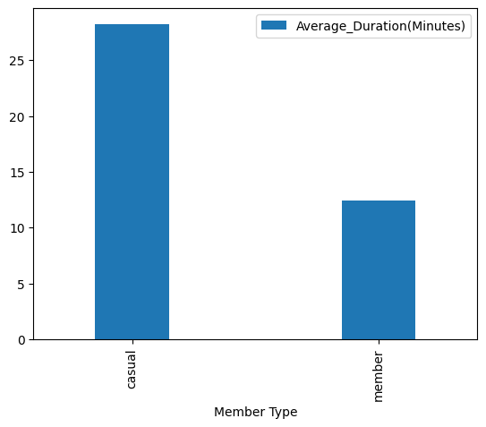
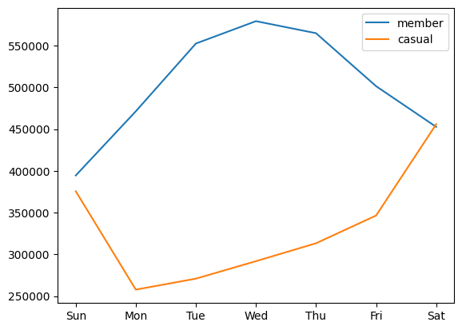
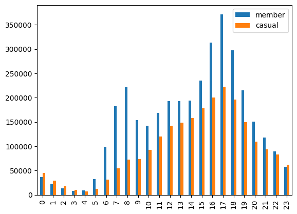
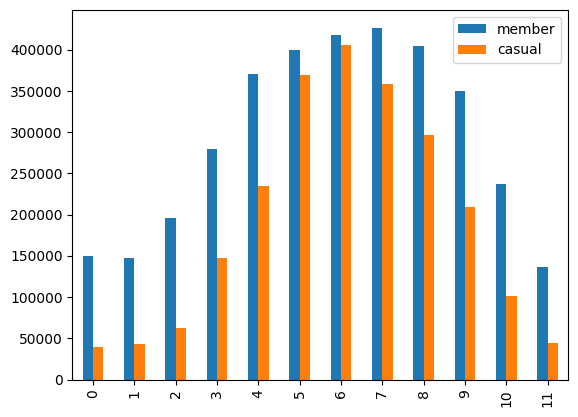

# Cyclist-Case-Study

## Introduction
This project is part of Google Data Analytics specialization. This is a capstone project where I'm supposed to share my learning. 
The case study is about a company called Cyclist which is a New York City based startup. The company provides a bike-sharing application which has a total of 5800 bicycles and 600 stations. The application provides 2 type of customers which are "casual" and "annual" members. 

## Business Task
How do annual members and casual riders use Cyclistic bikes differently? 
Objective: To understand how casual riders differ from annual members. 
Stakeholders: Lily Moreno, Marketing department, customers. 
## Data Sources
Data sources: [Divvy-Tripdata](https://divvy-tripdata.s3.amazonaws.com/index.html) 
Data indexes: June 2022 - May 2023 
Data info: The dataset contains a unique identifier for ride (ride_id), it has rideable type which has 3 type of bikes (classic_byke, docked_byke, electric_byke). It has start and end time of ride, stations, lattitude and longitude. At the end it has member_casual, a column which tells whether the customer is annual member or casual rider.  

## Data manipulation and cleaning
### Data manipulation
First, I downloaded the data from the given indexes (june 2022- May 2023). I've created a table for this specific dataset called "trips" in Postgresql and have imported the data in Postgresql. The table contains a total of 5829030 records. After setting up the data in postgres, I'm using psycopg2 library to connect the db to my python scripts. At the end I'm using python for the sql scripts along with visualizations.

### Data Cleaning

## Analysis and visualization
The dataset contained around 5.8 million rides. Following are the visualizations made to understand the differences between a casual rider and an annually subscribed rider.
### Total ride percentage

#### Insights
* Casual riders have ~39.7 percent of total rides
* Annual members have ~60.3 percent of total rides
* Annual members use the rides much more than casual riders

### Bike Type

#### Insights
* Casual members prefer electric and classic bikes with electric being the favourite type.
* Casual members have a very small percentage of audience using docked bikes
* Annual members only use electric and classic bikes with an almost equal share of rides.

### Ride duration 

#### Insights
* Casual members have an average ride time of ~28.21 minutes
* Annual members have an average ride time of 12.46 minutes.
* Casual members ride for almost **2.5X longer duration**. 

### Weekly ride distribution 

#### Insights
* Casual riders use the services most on **weekends**.  
* Annual members use the services on more on **weekdays**.
* Annual members probably use the ride service for **daily commute** while casual riders use for **leisure activities**. 

### Hourly Bike distribution

#### Insights
* Members use the bike service heavily during commute hours **(6:00 AM - 9:00 AM) and (4:00 PM - 7:00 PM)**.
* Casual members have an almost similar percentage of rides throughout the day time.
* The bar plot shows members use this service for commute daily.

### Monthly Bike distribution

#### Insights
* Casual members use the bike service mostly in **summer-fall season**.
* Casual members rarely use the service in **winter months**.
* The bar plot shows members use this service for **commute daily**.

## Conclusion and recommendations
After viewing all the above insights, following are the core differences I've noticed between the trends of casual riders and annual members.
#### Insights
* Casual members use this service for **leisure activity**.
* Annual members use this service for **daily commute**.

#### Recommendations
* Marketing schemes should be launched near parks and markets for casual riders.
* Discounts should be provided in winter season to maintain the customer count.
* Discounts should be provided in weekdays for casual members.
* Free trial of monthly membership should be provided to casual customer to convert them into annual customers.
