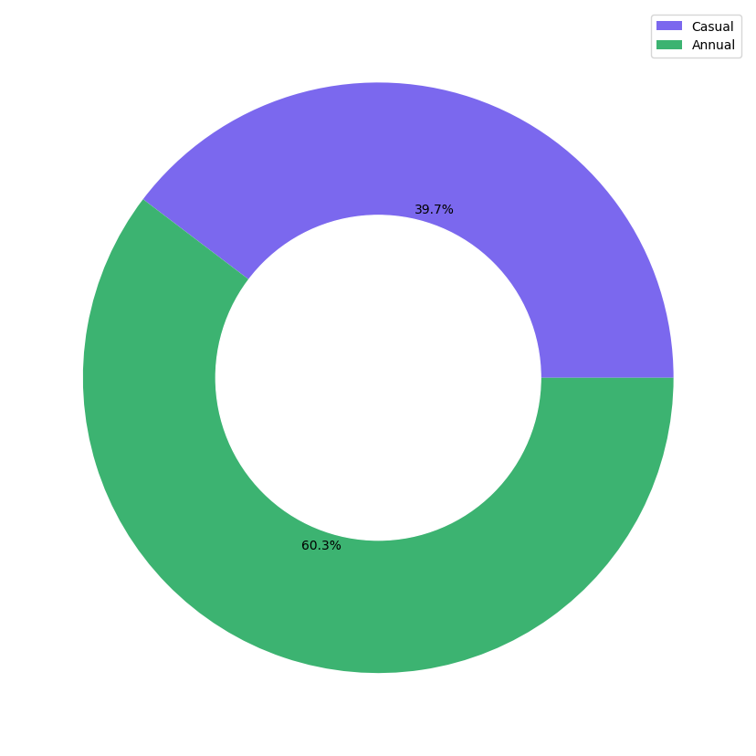

# Cyclist-Case-Study

## Introduction
This project is part of Google Data Analytics specialization. This is a capstone project where I'm supposed to share my learning. 
The case study is about a company called Cyclist which is a New York City based startup. The company provides a bike-sharing application which has a total of 5800 bicycles and 600 stations. The application provides 2 type of customers which are "casual" and "annual" members.

## Business Task
How do annual members and casual riders use Cyclistic bikes differently?
Objective: To understand how casual riders differ from annual members.
Stakeholders: Lily Moreno, Marketing department, customers
## Data Sources
Data sources: [Divvy-Tripdata](https://divvy-tripdata.s3.amazonaws.com/index.html)
Data indexes: June 2022 - May 2023
Data info: The dataset contains a unique identifier for ride (ride_id), it has rideable type which has 3 type of bikes (classic_byke, docked_byke, electric_byke). It has start and end time of ride, stations, lattitude and longitude. At the end it has member_casual, a column which tells whether the customer is annual member or casual rider. 

## Data manipulation and cleaning
### Data manipulation
First, I downloaded the data from the given indexes (june 2022- May 2023). I've created a table for this specific dataset called "trips" in Postgresql and have imported the data in Postgresql. The table contains a total of 5829030 records. After setting up the data in postgres, I'm using psycopg2 library to connect the db to my python scripts. At the end I'm using python for the sql scripts along with visualizations.

### Data Cleaning

## Analysis and visualization
The dataset contained around 5.8 million rides. Following are the visualizations made to understand the differences between a casual rider and an annually subscribed rider.

#### Insights
* Casual riders have ~39.7 percent of total rides
* Annual members have ~60.3 percent of total rides
* Annual members use the rides much more than casual riders

## Conclusion and recommendations